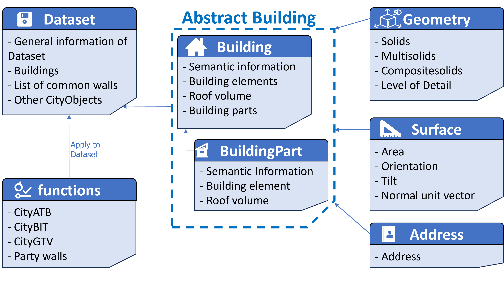

# CityDPC

CityDPC: A Python Library for 3D City Model Processing

CityDPC is an open-source Python library designed for handling and analyzing 3D city models in CityGML and CityJSON formats. It provides tools for geometric computations, including identifying shared walls between buildings—critical for urban energy simulations. The library enables the loading, validation, and manipulation of city datasets, supporting applications like Urban Building Energy Modeling (UBEM). CityDPC integrates with UBEM tools like TEASER+, streamlining urban-scale energy assessments by efficiently processing and analyzing large building datasets.


## Getting started

If you want to use CityDPC in your workflow you can install it using
```bash
pip install git+https://github.com/RWTH-E3D/CityDPC.git
```

If you want to run the examples, start by cloning the repo.
Continue by installing the package, while in the root director, using:
```bash
pip install .
```
If you are developing we highly recommend using the [Development Mode](https://setuptools.pypa.io/en/latest/userguide/development_mode.html) using:
```bash
pip install -e .
```

Also take a look at the [examples](examples)!

## Support
If you ran into any problems feel free to open a [new issue](https://github.com/RWTH-E3D/CityDPC/issues/new/choose) or reach out to one of the developers.

## Roadmap
Take a look at the [issues](https://github.com/RWTH-E3D/CityDPC/issues) any planned features will be listed there.

## Contributing
If you want to contribute have a look over at the [issues](https://github.com/RWTH-E3D/CityDPC/issues). Either open a new one for a feature you would like to work on and add your comments or find an issue missing an assignee and start working. Feel also free to reach out to one of the developers!

#### Fromatting & Linting
The code is formatted using [Python Black](https://github.com/psf/black) and linted using [flake8](https://github.com/PyCQA/flake8).

## Acknowledgment
We gratefully acknowledge the financial support by BMWK, promotional reference 03EWR010B.


## License
Available under the Apache 2.0 [License](License.md).
See the _Cite this repository_ function or the [CITATION.cff](CITATION.cff) for citation of this repository.

## Project status
Currently under active development.


## Latest Changes

- 0.1.20 CityGML - read all surfaceMember elements
- 0.1.19 fix measuredHeight assignment on CityJSON import
- 0.1.18 more warning options
- 0.1.17 fix datasetToDataframe mismatch
- 0.1.16 update License
- 0.1.15 (un-)allowedIDs parameter for imports
- 0.1.14 support for generic attributes on surfaces
- 0.1.13 support for gen:doubleAttributes on buildings
- 0.1.12 add reduce function to dataset for bulk deletions
- 0.1.11 better namespace creation for output
- 0.1.10 suppress warnings by type
- 0.1.9 more config options, fixed typo, minor address change
- 0.1.8 address handling improvements
- 0.1.7 fix empty geometrie creation/output
- 0.1.6 fix type of surface properties
- 0.1.5 fix index issue in collinear point detection
- 0.1.4 option for fixing single outliers in GroundSurfaces using input flags
- 0.1.3 warning for non planar surfaces
- 0.1.2 fixes for loading CityGML files
- 0.1.1 add more user config options
